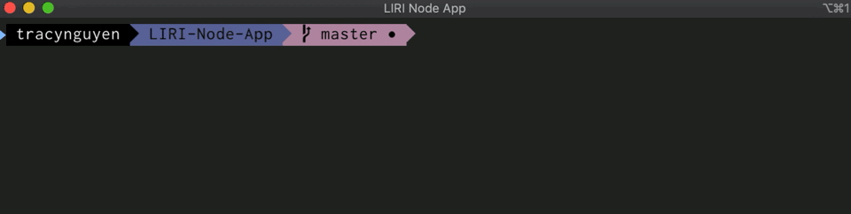
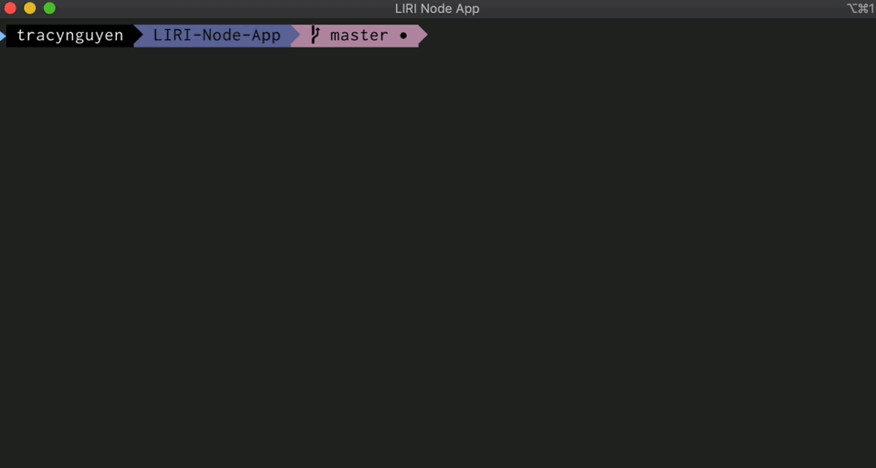
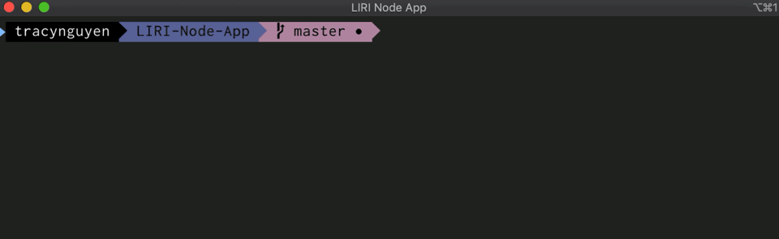

# LIRI Bot

> A simple command line app created with Node.js

## Overview

LIRI is like Iphone's SIRI. However, while SIRI is a Speech Interpretation and Recognition interfacem LIRI is a Language Interpretation and Recognition Interface. LIRI is a command line node app that takes in the following **parameters** and gives back data:

`concert-this` `spotify-this-song` `movie-this` `do-what-it-says` 

<!-- [TOC] -->

**:pushpin:Table of Contents**
[Overview](#overview)
[Set Up](#set-up)
[Screenshots](#screenshots-of-the-project)
[Technologies](#technologies)
[Documentation](#documentation)

-----

## Set Up

To run this project:

1. Clone repo
2. Run `npm install`
3. At command prompt run `node liri.js <parameters>` as shown below


## Screenshots of the Project

1. `<concert-this>`

   

   

2. `<spotify-this-song>`

   

   

3. `<movie-this>`

   

   

4. `<do-what-it-says>`

   


-----

## Technologies

- Node.JS

- JavaScript

-----

## Documentation

### What Each Command Should Do

1. `node liri.js concert-this <artist or band name here>`

   - This will search the Bands in Town Artist Events API (`"https://rest.bandsintown.com/artists/" + artist + "/events?app_id=codingbootcamp"`) for an artist and render the following information about each event to the terminal:

   - ```bash
     - Name of the venue
     - Venue location
     - Date of the Event (MM/DD/YYYY)
     ```

2. `node liri.js spotify-this-song <song name here>`

   - This will show the following information about the song in your terminal/bash window

   - ```bash
     - Artist(s)
     - Name of the song
     - A preview link of the song from Spotify
     - The album that the song is from
     ```

   - If no song is provided, the program will default to "The Sign" by Ace of Base.

   - You will utilize the [node-spotify-api](https://www.npmjs.com/package/node-spotify-api) package in order to retrieve song information from the Spotify API.

   - The Spotify API requires you sign up as a developer to generate the necessary credentials. 

3. `node liri.js movie-this <movie name here>`

   - This will output the following information to your terminal/bash window:

   - ```bash
     - Title of the movie.
     - Year the movie came out.
     - IMDB Rating of the movie.
     - Rotten Tomatoes Rating of the movie.
     - Country where the movie was produced.
     - Language of the movie.
     - Plot of the movie.
     - Actors in the movie.
     ```

   - If the user does not type a movie in, the program will output data for the movie 'Mr. Nobody.'

   - You'll use the `axios` package to retrieve data from the OMDB API. Like all of the in-class activities, the OMDB API requires an API key. You may use *trilogy*.
     

4. `node liri.js do-what-it-says`
   - Using the `fs` Node package, LIRI will take the text inside of *random.txt* and then use it to call one of LIRI's commands.
   - It will run `spotify-this-song` for "I Want it That Way," as follows the text in *random.txt*.
   - Edit the text in random.txt to test out the feature for movie-this and concert-this.

### Bonus

- In addition to logging the data to terminal/bash window, output the data to a .txt file called *log.txt*.